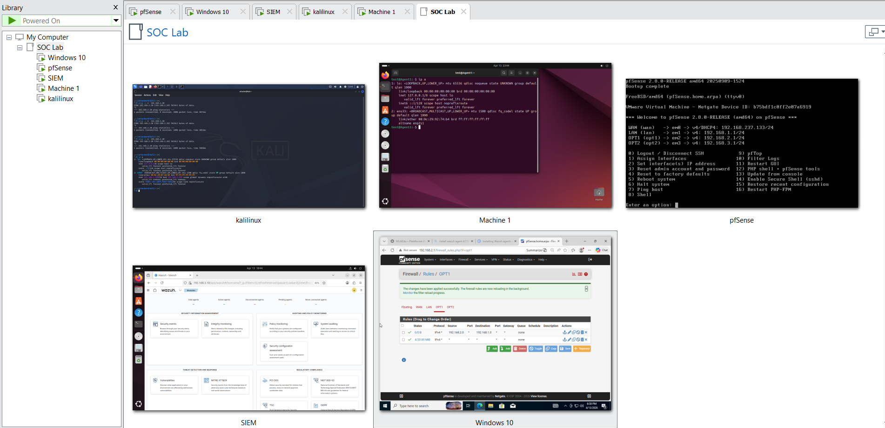
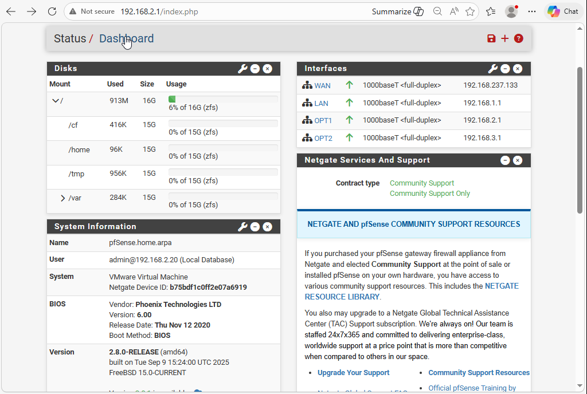
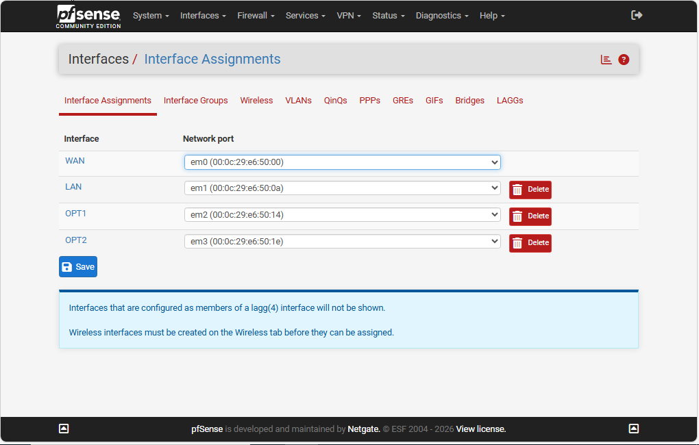

# Mini SOC Lab — Wazuh + pfSense

> A fully virtualized Security Operations Center (SOC) built for hands-on attack simulation, log collection, real-time detection, and incident response practice.


---

## Table of Contents

- [Objective](#objective)
- [Architecture Overview](#architecture-overview)
- [IP Addressing Plan](#ip-addressing-plan)
- [Infrastructure Setup](#infrastructure-setup)
  - [pfSense Configuration](#1-pfsense-configuration)
  - [Wazuh SIEM Deployment](#2-wazuh-siem-deployment)
  - [Windows Agent Setup](#3-windows-agent-setup)
  - [Ubuntu Agent Setup](#4-ubuntu-agent-setup)
  - [Kali Linux Setup](#5-kali-linux-setup)
- [Firewall Block Demonstration](#firewall-block-demonstration)
- [Attack Simulation](#attack-simulation)
- [Detection & Alerts](#detection--alerts)
- [Key Findings](#key-findings)
- [Challenges & Solutions](#challenges--solutions)
- [Skills Demonstrated](#skills-demonstrated)

---

## Objective

Build a realistic, isolated lab environment that simulates a corporate network with attacker, victim, and monitoring zones. The goal is to practice:

- Network segmentation and firewall rule enforcement
- Endpoint log collection and SIEM correlation
- Real-world attack techniques and their detection
- Incident response investigation workflow
- MITRE ATT&CK technique mapping

---

## Architecture Overview

```
                          ┌─────────────────────────────┐
                          │        ATTACKER ZONE         │
                          │    192.168.1.0/24 (EM1)      │
                          │   ┌──────────────────────┐   │
                          │   │    Kali Linux         │   │
                          │   │    192.168.1.10       │   │
                          │   └──────────────────────┘   │
                          └──────────────┬──────────────┘
                                         │ EM1 · 192.168.1.1
┌──────────┐   NAT        ┌──────────────▼──────────────┐
│ Internet │──────────────│         pfSense              │──────────────┐
└──────────┘  253.0/24    │     Router + Firewall        │              │
                          │  EM0(WAN) EM1 EM2 EM3        │              │
                          └──────────────┬──────────────┘              │
                                         │                              │
                   EM3 · 192.168.3.1     │    EM2 · 192.168.2.1        │
                          ┌──────────────┘              │              │
           ┌──────────────▼──────────────┐  ┌───────────▼──────────────┐
           │         SIEM ZONE            │  │       VICTIM ZONE        │
           │     192.168.3.0/24 (EM3)    │  │   192.168.2.0/24 (EM2)  │
           │  ┌────────────────────────┐  │  │  ┌──────────┐ ┌───────┐ │
           │  │   Wazuh Manager        │  │  │  │ Windows  │ │Ubuntu │ │
           │  │   192.168.3.10         │◄─┼──┼──│  .2.20   │ │ .2.30 │ │
           │  │   + OpenSearch         │  │  │  │  agent   │ │ agent │ │
           │  └────────────────────────┘  │  │  └──────────┘ └───────┘ │
           └──────────────────────────────┘  └──────────────────────────┘
                  ▲ Logs (UDP 1514)                  Log forwarding
```

> **Screenshot — VM Overview**
> 
> *All 4 VMs running simultaneously in VMware — pfSense, Kali, Windows, Wazuh*

---

## IP Addressing Plan

| Zone | Interface | Gateway IP | Subnet | Host(s) |
|---|---|---|---|---|
| WAN | EM0 | DHCP (ISP) | 192.168.253.0/24 | pfSense WAN |
| Attacker | EM1 | 192.168.1.1 | 192.168.1.0/24 | Kali Linux `192.168.1.10` |
| Victims | EM2 | 192.168.2.1 | 192.168.2.0/24 | Windows `192.168.2.20`, Ubuntu `192.168.2.30` |
| SIEM | EM3 | 192.168.3.1 | 192.168.3.0/24 | Wazuh `192.168.3.10` |

---

## Infrastructure Setup

### 1. pfSense Configuration

pfSense was installed on VMware with 4 network adapters mapped to internal networks. Interfaces were assigned via the console, then fully configured via the web UI at `http://192.168.1.1`.

**Interface assignment:**

```
em0 → WAN  (NAT / Internet)
em1 → LAN  (Attacker zone · 192.168.1.1/24)
em2 → OPT1 (Victim zone   · 192.168.2.1/24)
em3 → OPT2 (SIEM zone     · 192.168.3.1/24)
```

**Key commands used on pfSense (shell):**

```bash
# Check routing table
netstat -rn

# Disable firewall for baseline testing
pfctl -d

# Re-enable firewall
pfctl -e
```

**Firewall rules configured:**

| Interface | Source | Destination | Action | Purpose |
|---|---|---|---|---|
| LAN (Attacker) | 192.168.1.0/24 | 192.168.2.0/24 | PASS | Allow attacks to victims |
| LAN (Attacker) | 192.168.1.0/24 | 192.168.3.0/24 | BLOCK | Attacker cannot reach SIEM |
| OPT1 (Victims) | 192.168.2.0/24 | 192.168.3.10 port 1514 | PASS | Agent log forwarding |
| OPT1 (Victims) | 192.168.2.0/24 | 192.168.1.0/24 | BLOCK | Victims cannot reach attacker |

> **Screenshot — pfSense Dashboard**
> 
> *pfSense system dashboard showing all 4 interfaces with active status and assigned IPs*

> **Screenshot — Interface Assignments**
> 
> *Interface assignment table: em0=WAN, em1=LAN, em2=OPT1 (VICTIMS), em3=OPT2 (SIEM)*

> **Screenshot — Firewall Rules (LAN tab)**
> 
> *LAN firewall rules showing PASS and BLOCK entries with source/destination/action columns*

> **Screenshot — Firewall Rules (OPT1 tab)**
> 
> *OPT1 (victim zone) rules — allows log forwarding to Wazuh, blocks return traffic to attacker*

---

### 2. Wazuh SIEM Deployment

Wazuh was deployed on Ubuntu Server 22.04 (`192.168.3.10`) using the official all-in-one installation script. This installs the manager, indexer (OpenSearch), and dashboard in a single process.

**Static IP configuration via Netplan:**

```yaml
# /etc/netplan/00-installer-config.yaml
network:
  version: 2
  ethernets:
    ens33:
      dhcp4: no
      addresses:
        - 192.168.3.10/24
      routes:
        - to: default
          via: 192.168.3.1
      nameservers:
        addresses: [8.8.8.8]
```

```bash
# Apply network config
sudo netplan apply

# Verify
ip a
ping 192.168.3.1
```

**Wazuh installation:**

```bash
curl -sO https://packages.wazuh.com/4.7/wazuh-install.sh
curl -sO https://packages.wazuh.com/4.7/config.yml

# Edit config.yml to set node IP to 192.168.3.10, then:
bash wazuh-install.sh --generate-config-files
bash wazuh-install.sh --wazuh-indexer node-1
bash wazuh-install.sh --start-cluster
bash wazuh-install.sh --wazuh-server wazuh-1
bash wazuh-install.sh --wazuh-dashboard dashboard
```

Dashboard accessible at: `https://192.168.3.10`

**Syslog receiver enabled in `/var/ossec/etc/ossec.conf`:**

```xml
<remote>
  <connection>syslog</connection>
  <port>514</port>
  <protocol>udp</protocol>
  <allowed-ips>192.168.2.0/24</allowed-ips>
</remote>
```

> **Screenshot — Wazuh Dashboard Home**
> 
> *Wazuh overview page showing agent count, total events, alert severity distribution*

> **Screenshot — Wazuh Active Agents**
> 
> *Agents list — Windows victim showing status: Active, IP: 192.168.2.20, version 4.7.5*

---

### 3. Windows Agent Setup

Wazuh agent version 4.7.5 was installed on Windows 10 (`192.168.2.20`) and registered to the Wazuh manager.

**Installation:**

```powershell
# Silent install pointing to Wazuh manager
msiexec /i wazuh-agent-4.7.5-1.msi /q WAZUH_MANAGER="192.168.3.10"

# Start the service
NET START WazuhSvc

# Verify status
sc query WazuhSvc

# Manually register agent if needed
"C:\Program Files (x86)\ossec-agent\agent-auth.exe" -m 192.168.3.10
```

**Connectivity test before registration:**

```powershell
ipconfig
ping 192.168.3.10
Test-NetConnection 192.168.3.10 -Port 1514
```

**Additional log sources configured in `ossec.conf`:**

```xml
<localfile>
  <location>Security</location>
  <log_format>eventchannel</log_format>
</localfile>
<localfile>
  <location>System</location>
  <log_format>eventchannel</log_format>
</localfile>
```

---

### 4. Ubuntu Agent Setup

Wazuh agent was deployed on the Ubuntu victim machine (`192.168.2.30`) in the victim zone.

**Static IP configuration:**

```yaml
# /etc/netplan/*.yaml
network:
  version: 2
  ethernets:
    ens33:
      dhcp4: no
      addresses:
        - 192.168.2.30/24
      routes:
        - to: default
          via: 192.168.2.1
      nameservers:
        addresses: [8.8.8.8]
```

```bash
sudo netplan apply
```

**Agent installation and registration:**

```bash
# Download agent package
wget https://packages.wazuh.com/4.x/apt/pool/main/w/wazuh-agent/wazuh-agent_4.7.5-1_amd64.deb

# Install with manager address
sudo WAZUH_MANAGER="192.168.3.10" dpkg -i wazuh-agent_4.7.5-1_amd64.deb

# Enable and start
sudo systemctl enable wazuh-agent
sudo systemctl start wazuh-agent

# Verify
sudo systemctl status wazuh-agent

# Register if needed
sudo /var/ossec/bin/agent-auth -m 192.168.3.10
```

---

### 5. Kali Linux Setup

Kali Linux (`192.168.1.10`) operates in the isolated attacker zone. It has no direct route to the SIEM zone — only to the victim zone, enforced by pfSense.

**Connectivity verification:**

```bash
# Confirm local gateway
ping -c 4 192.168.1.1

# Confirm attacker can reach victim
ping -c 4 192.168.2.20

# Confirm SIEM is unreachable from attacker (expected: 100% loss)
ping -c 4 192.168.3.10
```

---

## Firewall Block Demonstration

This section demonstrates pfSense enforcing network segmentation by completely blocking the attacker from reaching victim machines — and showing that evidence of the block is captured both in pfSense logs and in Wazuh.

### Step 1 — Baseline: attacker reaches victim (BEFORE block rule)

```bash
# On Kali — confirms connectivity exists before rule is applied
ping -c 4 192.168.2.20
nmap -Pn -sS 192.168.2.20 -F
```

> **Screenshot — Before Block (Kali Terminal)**
> 
> *Kali terminal showing successful ping replies and open ports — full connectivity to victim*

---

### Step 2 — Apply block rule in pfSense

Rule added via `Firewall → Rules → LAN → Add` (placed at top of ruleset so it evaluates first):

```
Action:       Block
Interface:    LAN
Protocol:     any
Source:       192.168.1.0/24
Destination:  192.168.2.0/24
Log:          Enabled
Description:  Block attacker zone from victim zone
```

> **Screenshot — Block Rule in pfSense**
> 
> *pfSense LAN rules tab — red BLOCK icon at the top, source=attacker subnet, dest=victim subnet*

---

### Step 3 — Verify: attacker is now blocked (AFTER block rule)

```bash
# On Kali — same commands, now fail completely
ping -c 4 192.168.2.20          # Expected: 100% packet loss
nmap -Pn -sS 192.168.2.20 -F   # Expected: all ports filtered / host seems down
nc -zv 192.168.2.20 445         # Expected: connection timed out
nc -zv 192.168.2.20 3389        # Expected: connection timed out
```

> **Screenshot — After Block (100% Packet Loss)**
> 
> *Kali terminal showing 100% packet loss and Nmap reporting host as down — zero connectivity*

> **Screenshot — Before vs After Side by Side**
> 
> *Split terminal: left=ping replies (before), right=100% loss (after block rule applied)*

---

### Step 4 — pfSense logs confirm blocked traffic

In pfSense: `Status → System Logs → Firewall` — filtered by source IP `192.168.1.10`:

> **Screenshot — pfSense Firewall Log**
> 
> *pfSense firewall log showing red BLOCK entries: attacker IP → victim IP, timestamps, interface LAN*

---

### Step 5 — Wazuh ingests the block events as security alerts

Since pfSense forwards syslog to Wazuh (`192.168.3.10:514`), every blocked packet also appears in the SIEM:

> **Screenshot — Wazuh Alert from pfSense Block**
> 
> *Wazuh events showing pfSense block events — rule description, source IP 192.168.1.10, destination 192.168.2.20*

**Result:** The attacker is completely isolated. Network enforcement (pfSense) and detection (Wazuh) work as a single coordinated system.

---

## Attack Simulation

All attacks were launched from Kali (`192.168.1.10`) against Windows (`192.168.2.20`) and Ubuntu (`192.168.2.30`) victims, with the firewall block rule disabled for this phase.

---

### Attack 1 — Network Reconnaissance (Nmap)

**MITRE ATT&CK:** T1046 — Network Service Discovery

```bash
# Host discovery
nmap -sn 192.168.2.0/24

# Full service + OS detection scan
nmap -Pn -sS -sV -sC -O 192.168.2.20

# Fast top-100 port scan
nmap -Pn -sS 192.168.2.20 -F

# Save output for report
nmap -Pn -sV 192.168.2.20 -oN nmap-windows-victim.txt
```

> **Screenshot — Nmap Scan Output (Kali)**
> 
> *Kali terminal showing Nmap results: open ports, services, OS fingerprint for Windows victim*

---

### Attack 2 — Privilege Escalation Simulation

**MITRE ATT&CK:** T1098 — Account Manipulation

```cmd
REM On Windows victim (cmd as Administrator)
net user attacker P@ss123 /add
net localgroup administrators attacker /add
net user
```

> **Screenshot — Privilege Escalation (Windows CMD)**
> 
> *Windows cmd showing: new user "attacker" created and added to Administrators group*

---

### Attack 3 — File Integrity Monitoring Trigger

**MITRE ATT&CK:** T1565 — Data Manipulation

```cmd
REM Create suspicious file on victim desktop
echo simulated malware payload > C:\Users\victime1\Desktop\malicious.txt
echo stolen credentials > C:\Temp\creds_dump.txt
```

> **Screenshot — Malicious File Created**
> 
> *Windows Explorer showing malicious.txt on victim desktop — used to trigger FIM alert in Wazuh*

---

## Detection & Alerts

All attacks generated alerts in Wazuh within seconds of execution.

---

### Alert — Nmap Scan Detected

> **Screenshot — Wazuh Nmap Alert**
> 
> *Wazuh alert: rule ID 40101, source IP 192.168.1.10, description "Port scan detected", severity HIGH*

---

### Alert — New User Created + Privilege Escalation

> **Screenshot — Wazuh User Creation Alert**
> 
> *Wazuh alert detail: Windows Event ID 4720 (user created) + 4732 (added to Administrators)*

> **Screenshot — Alert JSON Detail**
> 
> *Expanded alert showing full JSON: win.eventdata.targetUserName, agent.name, rule.description, timestamp*

---

### Alert — File Integrity Monitoring Event

> **Screenshot — Wazuh FIM Alert**
> 
> *Wazuh syscheck event: file path, SHA256 hash before/after, event type "added", agent: windows-victim*

---

### MITRE ATT&CK Mapping

> **Screenshot — MITRE ATT&CK View**
> 
> *Wazuh MITRE ATT&CK dashboard showing triggered techniques: T1046, T1098, T1565 — all from this lab*

---

## Dashboards & Monitoring

> **Screenshot — Security Events Overview**
> 
> *Wazuh events timeline showing alert spike during attack simulation phase — events by severity and rule*

> **Screenshot — CIS Compliance Dashboard**
> 
> *CIS Benchmark analysis for Windows victim — pass/fail percentage across configuration checks*

> **Screenshot — pfSense Traffic Graph**
> 
> *pfSense interface traffic on EM2 (victim zone) during Nmap scan — visible traffic spike*

---

## Key Findings

| Finding | Evidence | Severity |
|---|---|---|
| Port scan detected within 3 seconds | Wazuh alert rule 40101 | High |
| New admin account created and logged | Windows Event ID 4720 + 4732 | Critical |
| File creation on victim desktop detected | Wazuh FIM syscheck event | Medium |
| pfSense block rule fully isolated attacker | 100% packet loss + pfSense log | Confirmed |
| pfSense block events forwarded to SIEM | Wazuh alert from syslog source | Confirmed |
| All 3 MITRE techniques successfully mapped | T1046, T1098, T1565 | — |

---

## Incident Report — IR-001

**Date:** 2024-XX-XX  
**Analyst:** [Your Name]  
**Severity:** HIGH

**Summary:**  
A simulated attacker (`192.168.1.10`) performed reconnaissance (port scan), created an unauthorized administrator account, and dropped suspicious files on the victim machine (`192.168.2.20`). All three activities were detected by Wazuh within seconds.

**Timeline:**

| Time | Event | Source |
|---|---|---|
| T+0:00 | Nmap scan launched from Kali | Kali terminal |
| T+0:03 | Scan detected — rule 40101 fired | Wazuh alert |
| T+2:00 | `net user attacker /add` executed | Windows cmd |
| T+2:05 | Event ID 4720 logged, Wazuh alert fired | Wazuh + Windows Security log |
| T+2:10 | `net localgroup administrators attacker /add` | Windows cmd |
| T+2:12 | Event ID 4732 — admin escalation detected | Wazuh alert |
| T+4:00 | malicious.txt created on desktop | Windows |
| T+4:55 | FIM event — file hash logged by Wazuh | Wazuh syscheck |

**Indicators of Compromise:**

- Attacker IP: `192.168.1.10`
- Rogue account: `attacker` (local administrator)
- Malicious file: `C:\Users\victime1\Desktop\malicious.txt`
- Techniques: T1046, T1098, T1565

**Containment:**  
Block rule applied in pfSense (`192.168.1.0/24 → 192.168.2.0/24` BLOCK). Rogue user account removed. Malicious files deleted.

**Recommendations:**

1. Enforce account creation alerting with immediate response playbook
2. Deploy fail2ban on Linux hosts and Windows account lockout policy
3. Enable Wazuh active response to auto-block attacker IPs on critical alerts
4. Add Suricata on pfSense for deep packet inspection

---

## Challenges & Solutions

| Challenge | Solution |
|---|---|
| Network connectivity issues between segments | Verified pfSense interface assignments and DHCP ranges; used `netstat -rn` to debug routing |
| DHCP misconfiguration on victim zone | Manually configured static IPs via Netplan (Ubuntu) and adapter settings (Windows) |
| Firewall blocking Wazuh agent traffic | Added explicit PASS rule for port 1514/1515 from victim zone to SIEM zone |
| Agent registration version mismatch | Matched agent version to manager version (4.7.5); re-ran `agent-auth` manually |
| pfSense syslog not arriving in Wazuh | Added `<allowed-ips>` block in `ossec.conf` and restarted `wazuh-manager` |

---

## Skills Demonstrated

| Category | Tools / Concepts |
|---|---|
| Network segmentation | pfSense, VLAN-equivalent isolated subnets, NAT, firewall rules |
| SIEM deployment | Wazuh 4.7.5, OpenSearch, agent enrollment, custom rules |
| Log collection | Windows Event Log, Sysmon, Linux syslog, pfSense syslog forwarding |
| Attack simulation | Nmap, privilege escalation, file integrity testing |
| Threat detection | FIM, user account monitoring, network scan detection |
| Compliance | CIS Benchmark assessment via Wazuh SCA |
| Threat mapping | MITRE ATT&CK framework (T1046, T1098, T1565) |
| Incident response | Alert triage, IOC identification, containment, reporting |
| Virtualization | VMware, multi-VM networking, snapshot management |
| Linux administration | Netplan, systemd, dpkg, UFW |

---

## Repository Structure

```
soc-lab/
├── README.md
├── screenshots/
│   ├── 01-infrastructure/
│   │   ├── vm-overview.png
│   │   ├── pfsense-dashboard.png
│   │   ├── pfsense-interfaces.png
│   │   ├── pfsense-fw-rules-lan.png
│   │   ├── pfsense-fw-rules-opt1.png
│   │   ├── wazuh-dashboard-home.png
│   │   └── wazuh-agents-active.png
│   ├── 02-firewall-demo/
│   │   ├── 01-before-block-ping.png
│   │   ├── 02-pfsense-block-rule.png
│   │   ├── 03-after-block-ping.png
│   │   ├── 04-before-after-split.png
│   │   ├── 05-pfsense-firewall-log.png
│   │   └── 06-wazuh-firewall-alert.png
│   ├── 03-attacks/
│   │   ├── 01-nmap-scan-kali.png
│   │   ├── 02-privilege-escalation-cmd.png
│   │   └── 03-fim-file-created.png
│   ├── 04-wazuh-alerts/
│   │   ├── 01-alert-nmap-detected.png
│   │   ├── 02-alert-new-user-created.png
│   │   ├── 03-alert-detail-json.png
│   │   ├── 04-alert-fim-event.png
│   │   └── 05-mitre-attack-view.png
│   └── 05-dashboards/
│       ├── 01-security-events-overview.png
│       ├── 02-cis-compliance.png
│       └── 03-pfsense-traffic-graph.png
├── rules/
│   └── local_rules.xml
├── config/
│   ├── ossec.conf
│   └── netplan-siem.yaml
└── reports/
    └── IR-001-privilege-escalation.md
```

---

## Author

Built as a personal SOC lab project to develop hands-on skills in blue team operations, SIEM deployment, and network security monitoring.

*LinkedIn: [your profile] | GitHub: [your profile]*
