# Mini SOC Lab — Wazuh + pfSense

> A fully virtualized Security Operations Center (SOC) built for hands-on attack simulation, log collection, real-time detection, and incident response practice.


---

## Table of Contents

- [Objective](#objective)
- [Architecture Overview](#architecture-overview)
- [IP Addressing Plan](#ip-addressing-plan)
- [Tools & Downloads](#tools--downloads)
- [Infrastructure Setup](#infrastructure-setup)
  - [pfSense Configuration](#1-pfsense-configuration)
  - [Wazuh SIEM Deployment](#2-wazuh-siem-deployment)
  - [pfSense → Wazuh Syslog Integration](#3-pfsense--wazuh-syslog-integration)
  - [Windows Agent Setup](#4-windows-agent-setup)
  - [Ubuntu Agent Setup](#5-ubuntu-agent-setup)
  - [Kali Linux Setup](#6-kali-linux-setup)
- [Firewall Block Demonstration](#firewall-block-demonstration)
- [Attack Simulation](#attack-simulation)
- [Detection & Alerts](#detection--alerts)
- [Key Findings](#key-findings)
- [Incident Report IR-001](#incident-report--ir-001)
- [Challenges & Solutions](#challenges--solutions)
- [Skills Demonstrated](#skills-demonstrated)

---

## Objective

Build a realistic, isolated lab environment that simulates a corporate network with attacker, victim, and monitoring zones. The goal is to practice:

- Network segmentation and firewall rule enforcement
- Endpoint log collection and SIEM correlation
- Real-world attack techniques and their detection
- Incident response investigation workflow
- MITRE ATT&CK technique mapping

---

## Architecture Overview

```
                          ┌─────────────────────────────┐
                          │        ATTACKER ZONE         │
                          │    192.168.1.0/24 (EM1)      │
                          │   ┌──────────────────────┐   │
                          │   │    Kali Linux         │   │
                          │   │    192.168.1.10       │   │
                          │   └──────────────────────┘   │
                          └──────────────┬───────────────┘
                                         │ EM1 · 192.168.1.1
┌──────────┐   NAT        ┌──────────────▼──────────────┐
│ Internet │──────────────│         pfSense              │
└──────────┘  253.0/24    │     Router + Firewall        │
                          │  EM0(WAN) EM1 EM2 EM3        │
                          └──────┬───────────┬───────────┘
                                 │           │
              EM3 · 192.168.3.1  │           │  EM2 · 192.168.2.1
           ┌─────────────────────┘           └──────────────────────┐
           │                                                         │
┌──────────▼──────────────────────┐   ┌──────────────────────────────▼──────┐
│          SIEM ZONE               │   │           VICTIM ZONE                │
│      192.168.3.0/24 (EM3)       │   │       192.168.2.0/24 (EM2)          │
│  ┌─────────────────────────────┐ │   │  ┌─────────────┐  ┌─────────────┐  │
│  │   Wazuh Manager 4.7.5       │◄┼───┼──│ Windows 10  │  │   Ubuntu    │  │
│  │   192.168.3.10              │ │   │  │ 192.168.2.20│  │192.168.2.30 │  │
│  │   + OpenSearch + Dashboard  │ │   │  │  (agent)    │  │  (agent)    │  │
│  └─────────────────────────────┘ │   │  └─────────────┘  └─────────────┘  │
└──────────────────────────────────┘   └──────────────────────────────────────┘
   ▲ Syslog UDP:514 (from pfSense)
   ▲ Agent logs UDP:1514 (from victims)
```

> **Screenshot — All VMs running in VMware**
> 
> *All 4 VMs powered on simultaneously: pfSense, Kali Linux, Windows 10, Wazuh (Ubuntu Server)*

---

## IP Addressing Plan

| Zone | Interface | Gateway IP | Subnet | Host(s) |
|---|---|---|---|---|
| WAN | EM0 | DHCP (ISP) | 192.168.253.0/24 | pfSense WAN |
| Attacker | EM1 | 192.168.1.1 | 192.168.1.0/24 | Kali Linux `192.168.1.10` |
| Victims | EM2 | 192.168.2.1 | 192.168.2.0/24 | Windows `192.168.2.20` · Ubuntu `192.168.2.30` |
| SIEM | EM3 | 192.168.3.1 | 192.168.3.0/24 | Wazuh Manager `192.168.3.10` |

---

## Tools & Downloads

Every tool used in this lab is free and open source.

| Tool | Version | Purpose | Download |
|---|---|---|---|
| pfSense CE | Latest | Firewall / Router / Network segmentation | [pfsense.org/download](https://www.pfsense.org/download/) |
| Wazuh | 4.7.5 | SIEM — log collection, correlation, detection | [documentation.wazuh.com](https://documentation.wazuh.com/current/installation-guide/index.html) |
| Kali Linux | Rolling | Attack simulation platform | [kali.org/get-kali](https://www.kali.org/get-kali/#kali-virtual-machines) |
| Ubuntu Server | 22.04 LTS | Wazuh host OS + Ubuntu victim | [ubuntu.com/download/server](https://ubuntu.com/download/server) |
| Windows 10 | Eval | Victim machine + Windows agent | [microsoft.com/evalcenter](https://www.microsoft.com/en-us/evalcenter/evaluate-windows-10-enterprise) |
| VMware Workstation | Player (free) | Hypervisor for all VMs | [vmware.com/products/workstation-player](https://www.vmware.com/products/workstation-player.html) |
| Wazuh Agent (Windows) | 4.7.5 | Windows endpoint monitoring | [wazuh-agent-4.7.5-1.msi](https://packages.wazuh.com/4.x/windows/wazuh-agent-4.7.5-1.msi) |
| Wazuh Agent (Linux) | 4.7.5 | Linux endpoint monitoring | [packages.wazuh.com › apt](https://packages.wazuh.com/4.x/apt/pool/main/w/wazuh-agent/) |
| Nmap | Latest | Network scanning / reconnaissance | Pre-installed on Kali · [nmap.org/download](https://nmap.org/download) |

---

## Infrastructure Setup

### 1. pfSense Configuration

pfSense CE was installed on VMware with 4 network adapters, each mapped to a dedicated internal network representing an isolated security zone.

**Interface assignment (console — option 1):**

```
em0 → WAN  (NAT / Internet · DHCP)
em1 → LAN  (Attacker zone · 192.168.1.1/24)
em2 → OPT1 (Victim zone   · 192.168.2.1/24)  renamed → VICTIMS
em3 → OPT2 (SIEM zone     · 192.168.3.1/24)  renamed → SIEM
```

**Shell commands used for diagnostics:**

```bash
# Check routing table — confirms inter-zone routes are present
netstat -rn

# Temporarily disable firewall for baseline connectivity testing
pfctl -d

# Re-enable firewall after testing
pfctl -e
```

**Firewall rules configured (WebUI):**

| Tab | Source | Destination | Action | Logged |
|---|---|---|---|---|
| LAN | 192.168.1.0/24 | 192.168.2.0/24 | PASS | Yes |
| LAN | 192.168.1.0/24 | 192.168.3.0/24 | BLOCK | Yes |
| OPT1 (VICTIMS) | 192.168.2.0/24 | 192.168.3.10 :1514 | PASS | Yes |
| OPT1 (VICTIMS) | 192.168.2.0/24 | 192.168.1.0/24 | BLOCK | Yes |
| OPT2 (SIEM) | 192.168.3.0/24 | any | PASS | No |
| WAN | any | any | BLOCK | Yes |

> **Screenshot — pfSense System Dashboard**
> 
> *pfSense dashboard — all 4 interfaces shown with active status and assigned IPs*

> **Screenshot — Interface Assignments**
> 
> *Interface table: em0=WAN, em1=LAN (attacker), em2=OPT1 (victims), em3=OPT2 (SIEM)*

> **Screenshot — Firewall Rules: LAN (Attacker zone)**
> 
> *LAN tab: PASS to victim zone, BLOCK to SIEM zone — attacker cannot touch monitoring infrastructure*

> **Screenshot — Firewall Rules: OPT1 (Victim zone)**
> 
> *OPT1 tab: PASS for agent traffic to Wazuh port 1514, BLOCK back to attacker zone*

> **Screenshot — Firewall Rules: OPT2 (SIEM zone)**
> 
> *OPT2 tab: SIEM zone permitted outbound for updates and dashboard access*

> **Screenshot — Firewall Rules: WAN**
> 
> *WAN tab: all unsolicited inbound traffic blocked by default*

---

### 2. Wazuh SIEM Deployment

Wazuh 4.7.5 deployed on Ubuntu Server 22.04 (`192.168.3.10`) using the [official all-in-one installation assistant](https://documentation.wazuh.com/current/installation-guide/wazuh-indexer/installation-assistant.html). This single process installs three components:

- **Wazuh Manager** — receives and processes agent logs
- **Wazuh Indexer** (OpenSearch) — stores and indexes all security events
- **Wazuh Dashboard** — visualization, alert management, and MITRE mapping

**Static IP via Netplan (required before installation):**

```yaml
# /etc/netplan/00-installer-config.yaml
network:
  version: 2
  ethernets:
    ens33:
      dhcp4: no
      addresses:
        - 192.168.3.10/24
      routes:
        - to: default
          via: 192.168.3.1
      nameservers:
        addresses: [8.8.8.8]
```

```bash
# Check interfaces
ip a

# Apply the config
sudo netplan apply

# Verify gateway
ping 192.168.3.1
```

**Wazuh all-in-one installation:**

```bash
curl -sO https://packages.wazuh.com/4.7/wazuh-install.sh
curl -sO https://packages.wazuh.com/4.7/config.yml

# Edit config.yml: set all node IPs to 192.168.3.10
bash wazuh-install.sh --generate-config-files
bash wazuh-install.sh --wazuh-indexer node-1
bash wazuh-install.sh --start-cluster
bash wazuh-install.sh --wazuh-server wazuh-1
bash wazuh-install.sh --wazuh-dashboard dashboard
```

Dashboard: `https://192.168.3.10` (credentials printed at end of install)

> **Screenshot — Wazuh Dashboard Home**
> 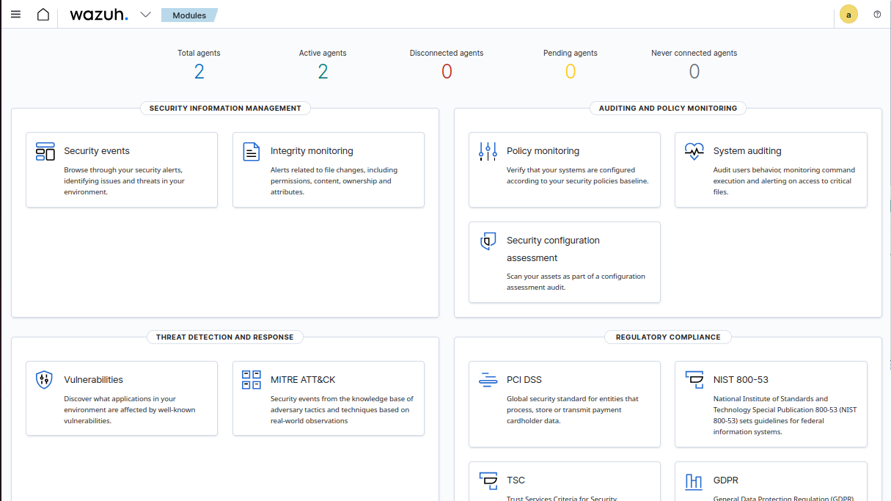
> *Wazuh home — agent count, total events, alert severity breakdown, module status all visible*

> **Screenshot — Wazuh Agents Page**
> 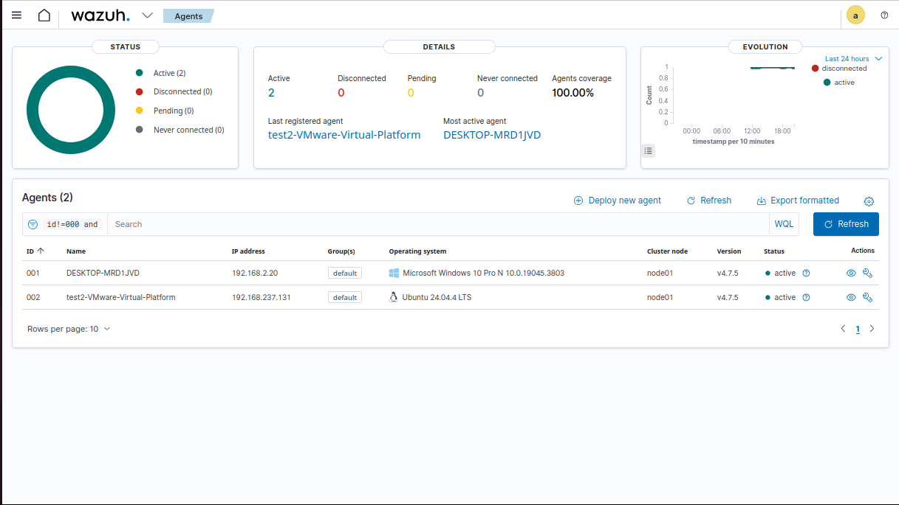
> *Agents list: Windows victim — Status=Active, IP=192.168.2.20, Version=4.7.5, last keepalive shown*

---

### 3. pfSense → Wazuh Syslog Integration

This integration closes the detection loop: every firewall event pfSense processes (connection, block, scan) is forwarded in real-time to Wazuh as a structured security alert — without installing any agent on pfSense.

#### Step A — Enable remote logging on pfSense

`Status → System Logs → Settings → Remote Logging`:

```
Enable Remote Logging:   ✅ checked
Remote log server:       192.168.3.10
Port:                    514
Protocol:                UDP
Log type:                Firewall events
```

Save. pfSense immediately begins streaming firewall events over UDP syslog.

> **Screenshot — pfSense Remote Log Configuration**
> 
> *pfSense remote logging: Wazuh manager IP 192.168.3.10, port 514 UDP, firewall events selected*

#### Step B — Configure Wazuh to accept syslog input

Edit `/var/ossec/etc/ossec.conf` on the Wazuh manager — add a second `<remote>` block alongside the existing agent listener:

```xml
<!-- Existing block — DO NOT remove (agent connections) -->
<remote>
  <connection>secure</connection>
  <port>1514</port>
  <protocol>udp</protocol>
</remote>

<!-- New block — syslog from pfSense -->
<remote>
  <connection>syslog</connection>
  <port>514</port>
  <protocol>udp</protocol>
  <allowed-ips>192.168.3.1</allowed-ips>   <!-- pfSense OPT2 interface IP -->
</remote>
```

```bash
# Restart manager to apply
sudo systemctl restart wazuh-manager

# Confirm both ports are listening
ss -ulnp | grep -E '514|1514'
```

> **Screenshot — ossec.conf with both remote blocks**
> 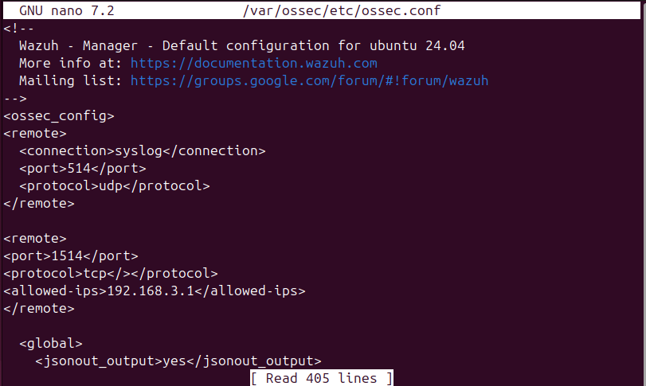
> *ossec.conf showing port 1514 (agents) and port 514 (pfSense syslog) coexisting correctly*

#### End-to-end data flow

```
Kali scans / hits block rule
         │
         ▼
pfSense evaluates rule → BLOCK → writes log entry
         │
         │  UDP syslog · port 514
         ▼
Wazuh Manager (192.168.3.10)
         │
         │  Parses + enriches event
         ▼
OpenSearch indexes it → alert visible in Wazuh Dashboard
```

**Result:** Network enforcement (pfSense) and threat detection (Wazuh) operate as one unified system. Zero agents required on the firewall.

---

### 4. Windows Agent Setup

Wazuh agent 4.7.5 installed on Windows 10 (`192.168.2.20`).

**Download:** [wazuh-agent-4.7.5-1.msi](https://packages.wazuh.com/4.x/windows/wazuh-agent-4.7.5-1.msi)

```powershell
# Silent install — registers agent to Wazuh manager
msiexec /i wazuh-agent-4.7.5-1.msi /q WAZUH_MANAGER="192.168.3.10"

# Start the service
NET START WazuhSvc

# Verify service state
sc query WazuhSvc

# Manual registration if auto-enroll fails
"C:\Program Files (x86)\ossec-agent\agent-auth.exe" -m 192.168.3.10
```

**Pre-install connectivity test:**

```powershell
ipconfig
ping 192.168.3.10
Test-NetConnection 192.168.3.10 -Port 1514
```

**Additional log sources (`ossec.conf` on agent):**

```xml
<localfile>
  <location>Security</location>
  <log_format>eventchannel</log_format>
</localfile>
<localfile>
  <location>System</location>
  <log_format>eventchannel</log_format>
</localfile>
```

---

### 5. Ubuntu Agent Setup

Wazuh agent deployed on Ubuntu victim (`192.168.2.30`).

**Download:** [packages.wazuh.com › apt pool](https://packages.wazuh.com/4.x/apt/pool/main/w/wazuh-agent/)

**Static IP (Netplan):**

```yaml
network:
  version: 2
  ethernets:
    ens33:
      dhcp4: no
      addresses:
        - 192.168.2.30/24
      routes:
        - to: default
          via: 192.168.2.1
      nameservers:
        addresses: [8.8.8.8]
```

```bash
sudo netplan apply
ping 192.168.2.1      # gateway check
ping 192.168.3.10     # Wazuh reachable
```

**Agent install and registration:**

```bash
wget https://packages.wazuh.com/4.x/apt/pool/main/w/wazuh-agent/wazuh-agent_4.7.5-1_amd64.deb

sudo WAZUH_MANAGER="192.168.3.10" dpkg -i wazuh-agent_4.7.5-1_amd64.deb

sudo systemctl enable wazuh-agent
sudo systemctl start wazuh-agent

# Verify
sudo systemctl status wazuh-agent

# Manual registration
sudo /var/ossec/bin/agent-auth -m 192.168.3.10
```

---

### 6. Kali Linux Setup

Kali (`192.168.1.10`) operates in the isolated attacker zone. pfSense allows it to reach victims but blocks it from the SIEM zone by design.

**Download:** [kali.org/get-kali](https://www.kali.org/get-kali/#kali-virtual-machines) — VMware image available directly

```bash
# Verify interfaces
ip a

# Gateway reachable
ping -c 4 192.168.1.1

# Victim reachable (before any block rule)
ping -c 4 192.168.2.20

# SIEM NOT reachable from attacker (expected: 100% packet loss — by design)
ping -c 4 192.168.3.10
```

---

## Firewall Block Demonstration

The core security proof: pfSense enforces zone isolation by completely cutting the attacker off from victims. Evidence is captured at two layers — the network firewall (pfSense logs) and the SIEM (Wazuh alerts).

---

### Step 1 — Baseline: attacker reaches victim (BEFORE block rule)

```bash
ping -c 4 192.168.2.20
nmap -Pn -sS 192.168.2.20 -F
```

> **Screenshot — Before Block**
> 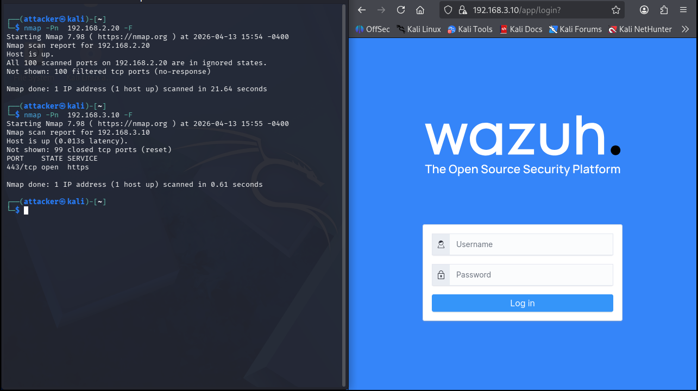
> *Kali: ping replies with 0% packet loss, Nmap shows open ports — attacker has full access to victim*

---

### Step 2 — Apply block rule in pfSense

`Firewall → Rules → LAN → Add` (placed at top of list so it's evaluated first):

```
Action:       Block
Interface:    LAN
Protocol:     any
Source:       Network → 192.168.1.0 / 24
Destination:  Network → 192.168.2.0 / 24
Log:          ✅ Enabled  ← required for pfSense firewall log entries
Description:  Block attacker zone from victim zone
```

> **Screenshot — Block Rule Applied**
> 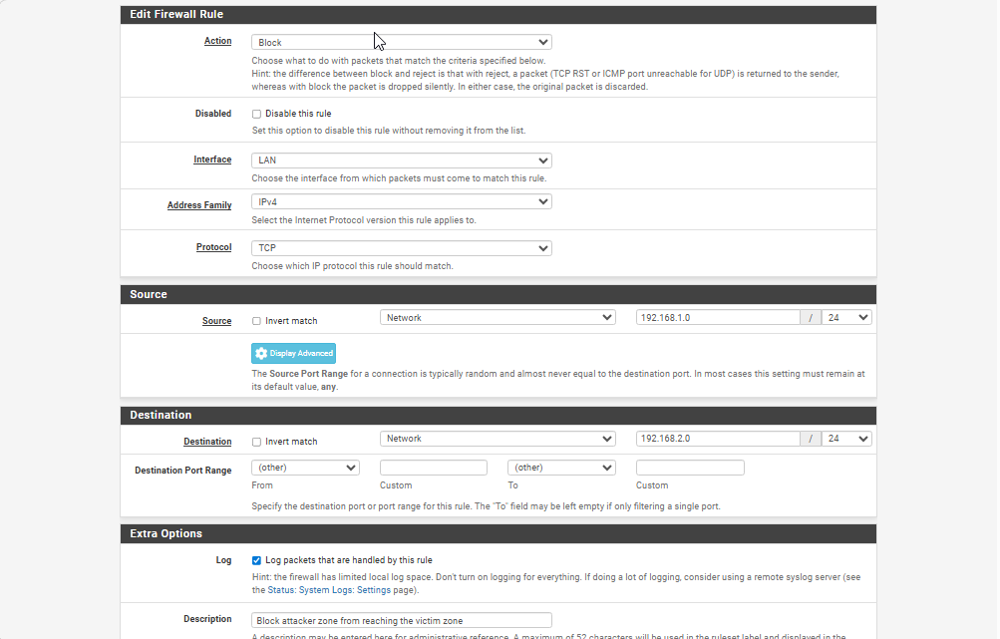
> *LAN rules tab: red BLOCK icon at top, source=attacker /24, destination=victim /24, logging enabled*

---

### Step 3 — Verify: attacker is fully blocked (AFTER block rule)

```bash
ping -c 4 192.168.2.20           # Expected: 100% packet loss
nmap -Pn -sS 192.168.2.20 -F    # Expected: host seems down / all ports filtered
nc -zv 192.168.2.20 445          # SMB — connection timed out
nc -zv 192.168.2.20 3389         # RDP — connection timed out
```

> **Screenshot — After Block (100% Packet Loss)**
> 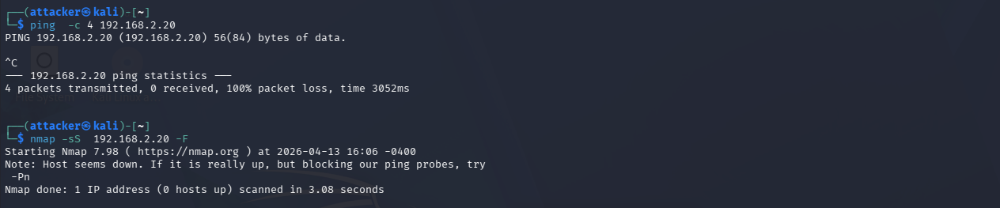
> *Kali: 100% packet loss, Nmap reports host as down — zero connectivity to victim zone*

> **Screenshot — Attacker Blocked (connection refused)**
> 
> *Kali: all TCP connection attempts to victim ports timeout — firewall silently dropping packets*

> **Screenshot — Before vs After Side by Side**
> 
> *Split view: left=successful ping before rule, right=100% packet loss after rule — same machine, same target*

---

### Step 4 — pfSense firewall log records every blocked packet

`Status → System Logs → Firewall` — filtered by source `192.168.1.10`:

> **Screenshot — pfSense Firewall Log**
> 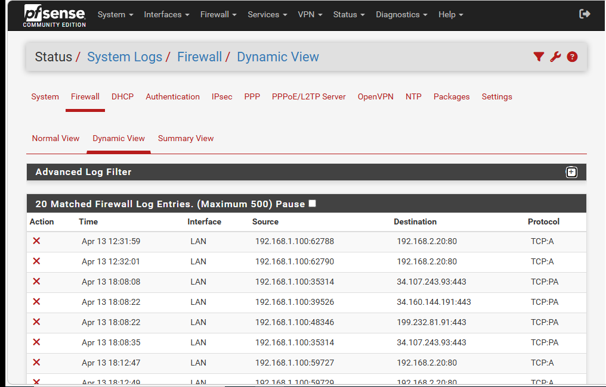
> *Firewall log: red BLOCK entries per row — attacker IP, victim IP, timestamp, interface LAN, protocol*

---

### Step 5 — Wazuh ingests the blocks as security alerts

pfSense streams these events to Wazuh via UDP syslog (port 514). Every blocked packet becomes a searchable Wazuh security event:

> **Screenshot — Wazuh Alerts from pfSense Blocks**
> 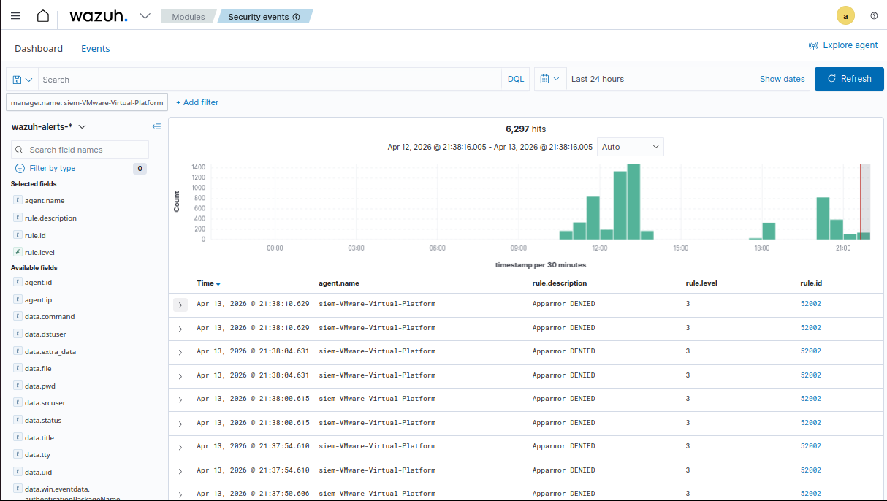
> *Wazuh events: pfSense block entries indexed — source IP 192.168.1.10, rule description, severity, timestamp*

**Full detection loop confirmed:**

```
Attacker scans  ──►  pfSense BLOCKS  ──►  logs event  ──►  Wazuh ALERTS
                           ▲                                      ▲
                     Network layer                          SIEM layer
```

---

## Attack Simulation

All attacks launched from Kali (`192.168.1.10`) against Windows victim (`192.168.2.20`). The block rule was temporarily disabled for this phase to allow traffic to reach the victim — demonstrating that attacks that do land are also detected.

---

### Attack 1 — Network Reconnaissance

**MITRE ATT&CK:** [T1046 — Network Service Discovery](https://attack.mitre.org/techniques/T1046/)

```bash
# Host discovery across victim subnet
nmap -sn 192.168.2.0/24

# Full service + OS detection
nmap -Pn -sS -sV -sC -O 192.168.2.20

# Fast top-100 port scan
nmap -Pn -sS 192.168.2.20 -F

# Save result for report
nmap -Pn -sV 192.168.2.20 -oN nmap-windows-victim.txt
```

> **Screenshot — Nmap Scan Output (Kali)**
> 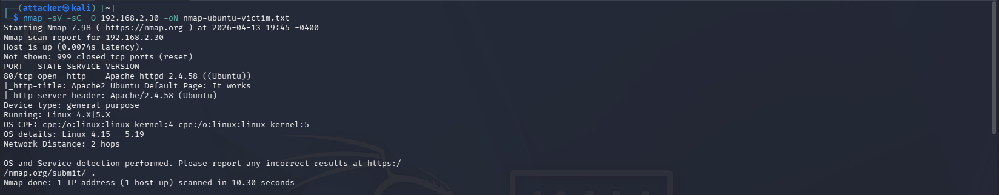
> *Nmap terminal output: open ports, service versions, OS fingerprint detected on Windows 10 victim*

---

### Attack 2 — Privilege Escalation Simulation

**MITRE ATT&CK:** [T1098 — Account Manipulation](https://attack.mitre.org/techniques/T1098/)

```cmd
REM On Windows victim — run cmd as Administrator
net user attacker P@ss123 /add
net localgroup administrators attacker /add
net user
```

> **Screenshot — Privilege Escalation (Windows CMD)**
> 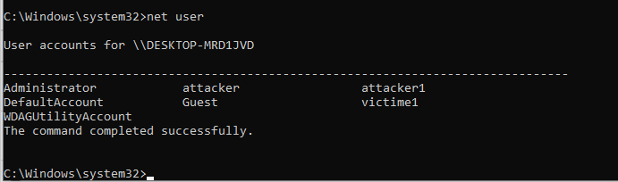
> *Windows cmd: user "attacker" created + added to Administrators group — command output visible*

---

### Attack 3 — File Integrity Monitoring Trigger

**MITRE ATT&CK:** [T1565 — Data Manipulation](https://attack.mitre.org/techniques/T1565/)

```cmd
REM Drop suspicious files on victim system
echo simulated malware payload > C:\Users\victime1\Desktop\malicious.txt
echo stolen credentials       > C:\Temp\creds_dump.txt
```

> **Screenshot — Malicious File Created**
> 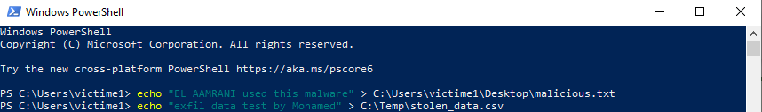
> *Windows: malicious.txt on victim desktop — triggers Wazuh FIM alert with file hash + path*

---

## Detection & Alerts

All attacks generated Wazuh alerts within seconds of execution.

---

### Alert — User Created + Escalated to Admin

Windows Event ID `4720` (user created) and `4732` (added to Administrators) both captured and correlated:

> **Screenshot — Wazuh Alert: New User + Privilege Escalation**
> 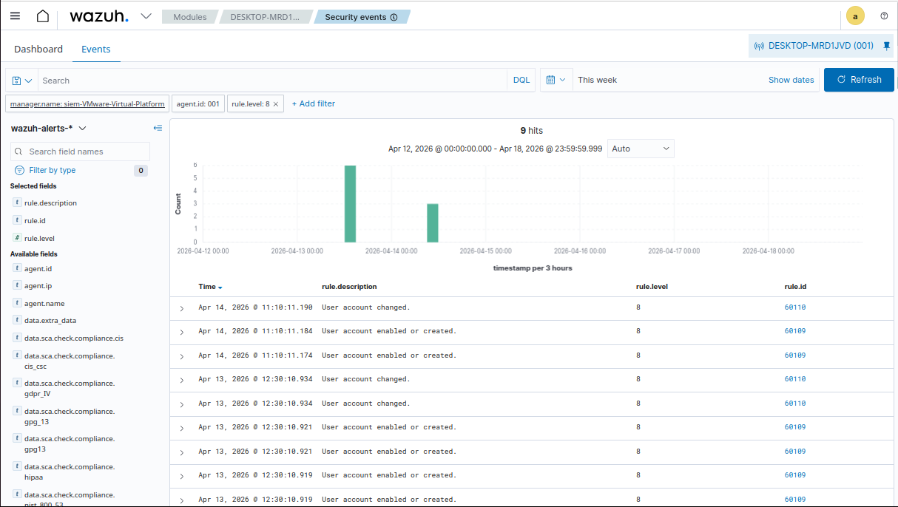
> *Alert detail: win.eventdata.targetUserName="attacker", EventID=4720/4732, rule level=12, agent=windows-victim*

---

### MITRE ATT&CK Coverage

All simulated techniques automatically mapped by Wazuh:

| Technique ID | Name | Triggered by |
|---|---|---|
| [T1046](https://attack.mitre.org/techniques/T1046/) | Network Service Discovery | Nmap scan from Kali |
| [T1098](https://attack.mitre.org/techniques/T1098/) | Account Manipulation | net user + net localgroup |
| [T1565](https://attack.mitre.org/techniques/T1565/) | Data Manipulation | malicious.txt file drop |

---

## Key Findings

| Finding | Evidence | Severity |
|---|---|---|
| Port scan detected within 3 seconds | Wazuh alert — rule 40101 | High |
| Rogue admin account created and logged | Windows Event ID 4720 + 4732 | Critical |
| File creation on victim desktop detected | Wazuh FIM syscheck event — hash recorded | Medium |
| pfSense block rule fully isolated attacker | 100% packet loss + pfSense firewall log entries | Confirmed |
| pfSense blocks forwarded to Wazuh SIEM | Wazuh alerts ingested via UDP 514 syslog | Confirmed |
| MITRE ATT&CK techniques mapped | T1046 · T1098 · T1565 visible in dashboard | — |

---

## Incident Report — IR-001

**Date:** 2024-XX-XX · **Analyst:** [Your Name] · **Severity:** HIGH

**Summary:** Simulated attacker (`192.168.1.10`) performed reconnaissance, created an unauthorized administrator account, and dropped suspicious files on victim `192.168.2.20`. All activities detected and logged by Wazuh.

**Attack timeline:**

| Time | Event | Detection Source |
|---|---|---|
| T+0:00 | Nmap scan launched from Kali | Kali terminal |
| T+0:03 | Scan detected — Wazuh rule 40101 fired | Wazuh alert |
| T+2:00 | `net user attacker /add` executed | Windows cmd |
| T+2:05 | Event ID 4720 — Wazuh alert triggered | Windows Security log |
| T+2:10 | `net localgroup administrators attacker /add` | Windows cmd |
| T+2:12 | Event ID 4732 — admin escalation detected | Wazuh alert |
| T+4:00 | malicious.txt dropped on victim desktop | Windows |
| T+4:55 | FIM event — file path + SHA256 logged | Wazuh syscheck |

**Indicators of Compromise:**

- Attacker IP: `192.168.1.10`
- Rogue account: `attacker` (local administrator)
- Malicious file: `C:\Users\victime1\Desktop\malicious.txt`
- MITRE techniques: T1046 · T1098 · T1565

**Containment:** Block rule applied in pfSense (`192.168.1.0/24 → 192.168.2.0/24 BLOCK`). Rogue account removed: `net user attacker /delete`. Malicious files deleted.

**Recommendations:**

1. Enforce account creation alert with automatic Wazuh active response
2. Windows account lockout after 5 failed attempts (Group Policy)
3. Wazuh active response: auto-block attacker IP on critical severity alerts
4. Deploy Suricata on pfSense for deep packet inspection
5. SSH key-only authentication on all Linux hosts

---

## Challenges & Solutions

| Challenge | Root Cause | Solution |
|---|---|---|
| No connectivity between victim and SIEM | OPT1 firewall rules missing port 1514 PASS | Added explicit PASS rule: 192.168.2.0/24 → 192.168.3.10 port 1514 |
| DHCP not working on victim zone | OPT1 DHCP service not enabled | Enabled under `Services → DHCP Server → OPT1` |
| pfSense blocking inter-zone by default | Default deny on non-LAN interfaces | Created explicit PASS rules on OPT1 and OPT2 tabs |
| Wazuh agent registration failed | Port 1515 blocked by OPT1 firewall rule | Added PASS rule for port 1515 (enrollment) alongside 1514 |
| pfSense syslog not arriving in Wazuh | `allowed-ips` in ossec.conf used wrong IP | Changed to pfSense OPT2 IP `192.168.3.1`, restarted manager |
| Ubuntu static IP not applying | Netplan YAML indentation error | Fixed formatting, re-ran `sudo netplan apply` |

---

## Skills Demonstrated

| Category | Tools / Concepts |
|---|---|
| **Network segmentation** | pfSense, zone-based firewall, NAT, inter-zone routing |
| **SIEM deployment** | Wazuh 4.7.5, OpenSearch, all-in-one installation |
| **Log integration** | pfSense → Wazuh syslog (UDP 514) · agent logs (UDP 1514) |
| **Endpoint monitoring** | Wazuh agents on Windows + Linux, ossec.conf tuning |
| **Attack simulation** | Nmap, privilege escalation, FIM triggering |
| **Threat detection** | Port scan, account monitoring, file integrity monitoring |
| **Threat mapping** | MITRE ATT&CK — T1046, T1098, T1565 |
| **Compliance** | CIS Benchmark via Wazuh SCA module |
| **Incident response** | Alert triage, IOC identification, containment, IR reporting |
| **Virtualization** | VMware Workstation, multi-VM internal networking |
| **Linux administration** | Netplan, systemd, dpkg, ss, netstat |
| **Windows administration** | PowerShell, sc query, MSI silent install, Event Viewer |

---

## Repository Structure

```
soc-lab/
├── README.md
├── screenshots/
│   ├── pfSense logs go to Wazuh.png
│   ├── varossecetcossec.conf.png
│   ├── 01-infrastructure/
│   │   ├── vm-overview.png
│   │   ├── pfsense-dashboard.png
│   │   ├── pfsense-interfaces.png
│   │   ├── Firewall rules LAN.png
│   │   ├── Firewall rules OPT1.png
│   │   ├── Firewall rules OPT2.png
│   │   ├── Firewall rules WAN.png
│   │   ├── Wazuh-dashboard.png
│   │   └── Wazuh-agents-page.png
│   ├── 02-firewall-demo/
│   │   ├── before-block-ping.png
│   │   ├── pfsense-block-rule.png
│   │   ├── after-block-ping.png
│   │   ├── attacker bolcked.png
│   │   ├── befor and after firewall.png
│   │   ├── pfsense-firewall-log.png
│   │   └── wazuh-firewall-alerts.png
│   ├── 03-attacks/
│   │   ├── nmap-scan-kali.png
│   │   ├── privilege-escalation-cmd.png
│   │   └── fim-file-creation.png
│   ├── 04-wazuh-alerts/
│   │   └── alert-new-user-created.png
│   └── 05-dashboards/
├── rules/
│   └── local_rules.xml
├── config/
│   ├── ossec.conf
│   └── netplan-siem.yaml
└── reports/
    └── IR-001-privilege-escalation.md
```

---

## Author

Built as a hands-on SOC lab project to develop practical skills in blue team operations, SIEM engineering, network security monitoring, and incident response.

*LinkedIn: [your profile] · GitHub: [your profile]*
